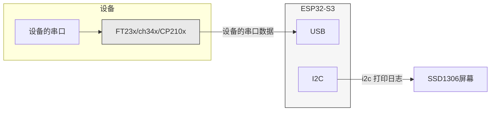
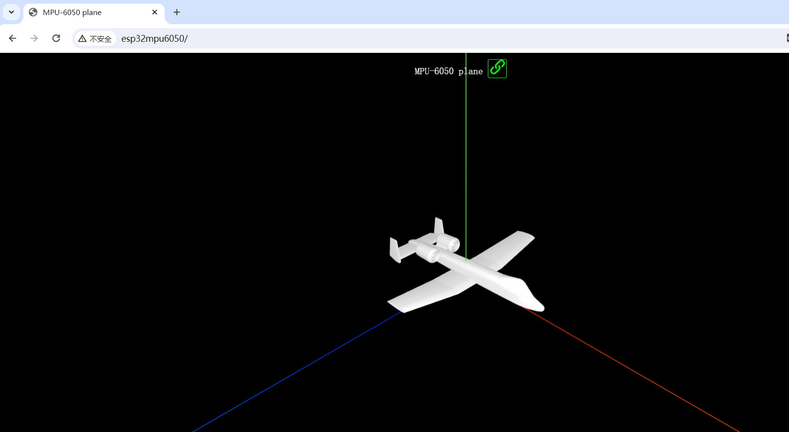

# espressif-demo

#### 介绍
esp32 esp8266 示例代码


### 项目

* [cam-udp-s3-tft](./cam-udp-s3-tft)  esp32-esp32 无线视频监控

  使用esp32cam采集图片发送给esp32s3通过tft显示

* [cam_lcd](./cam_lcd)  esp32使用spi屏幕 st7789显示画面

* [cam_rgb565_lcd](./cam_lcd)  esp32使用spi屏幕 st7789显示画面，但摄像头使用rgb565输出。

* [TestSPIFFS](./TestSPIFFS) SPIFFS读取入门，使用platformio一键将文件写入flash后从中读取。

  platformio esp32 项目data目录使用。 

* [web](./web)  esp32 使用静态html文件的web服务。

* [ws_echo_server](./ws_echo_server) websocket server 移植于esp-idf ws_echo_server。本身已经包含http server无需再使用额外的http服务。

* [esp32Vue](./esp32Vue) platformio 集成esp32 整合 vue 项目示例。

  需要nodejs npm环境。

  将一个vue 3.0 hello world项目 集成，可以通过platformio 一键构建 vue项目，并将生成文件写入esp32 flash。

  esp32作为服务端正确发送打包好的项目给浏览器。

  并含platformio 自定义脚本 自定义task 示例。 用于拓展ci。
  
* [esp32WebSystemInfo](./esp32WebSystemInfo) platformio 集成esp32 整合 vue 项目示例。通过web获取esp32信息，和控制esp32 板载led示例。

  在一个项目基础上整合 UI框架，[**arco design**]([Arco Design Vue](https://arco.design/vue/docs/start))

* [s3Rgb](./s3Rgb) ESP32-S3-DevKitC-1 板载RGB灯示例,web控制rgb颜色

* [cam_ai](./cam_ai) ESP32-S3-WROOM CAM + ST7789 人脸检测+识别

* [idf_mpu6050](./idf_mpu6050) 使用idf组件库里的MPU6050库,读取加速度，陀螺仪参数和温度的例程。

* [i2s_recorder](./i2s_recorder) ESP32-S3-WROOM CAM +  INMP441 i2s标准模式 录音到sd卡。

* [cdc_acm_vcp](./cdc_acm_vcp) esp32 USB驱动串口转USB芯片,场景如下:

  ```mermaid
  graph LR
    subgraph ESP32-S3
      USB[USB]
    end
  
   subgraph 设备
    DeviceUSBSerial[FT23x/ch34x/CP210x]
    URAT[设备的串口]
  end
    USB <-->|Nested Connection| DeviceUSBSerial
  DeviceUSBSerial <--> URAT
    classDef Default_ fill:#f6f6f6,stroke:#333,stroke-width:1px;
    classDef nested fill:#e9e9e9,stroke:#333,stroke-width:1px;
  
    class ESP32-S3, Default_
    class Device, Default_
    class DeviceUSBSerial, nested
  
  ```

  

* [cdc_acm_vcp_monitor](./cdc_acm_vcp_monitor) esp32 USB串口查看器。

  类似于PC查看串口，直插usb查看串口。



* [80211raw](./80211raw)  esp32 对 esp32 使用80211帧通讯。

  类似于espnow无需建立sta ap 连接场景， 直接对空中发包和接受空中wifi帧来通讯的方式。

  但相比于espnow可以有更大的报文长度和更高的带宽。无需使用真实mac地址，可以事先约定源和目标地址，结合编写适当过滤规则即可通讯。

  同时espnow本质也是一种特定的80211中的帧。

* [algorithm](./algorithm) 算法，主要是安全相关的算法库使用，包括哈希，加密，和密钥协商算法。
  * [encryption](./algorithm/encryption) 加密算法 
  * [hash](./algorithm/hash) 哈希算法 MD5 /SHA256

* [ffmpeg](./ffmpeg) esp32推送mjpeg给ffmpeg编码后推流例程。

  esp32通过udp/tcp推送jpeg帧给ffmpeg,ffmpeg以h.264编码后以rtp推流，再使用vlc等播放器播放rtp流。


* [hid_host](./hid_host) esp32 作为HID主机，可使用鼠标和键盘对esp32输入.

* [data_time](./date_time) 日期和时间，esp32和esp8266使用ntp对时成功后并本地获取时间格式化打印。

  

* [mpu6050_view](./mpu6050_view) esp32作为web服务端，提供web通过3d视图显示mpu6050的状态

  

 

* [newPio](./newPio) 在PIO使用新版的arduino平台(目前3.0.1) 支持esp32c6和esp32h2等，该项目未配置esp32h2可以参考esp32c6的配置对照编写一份h2的项目。
* [usb_host_msc](./usb_host_msc) esp32作为主机读写U盘或其他MSC设备。
