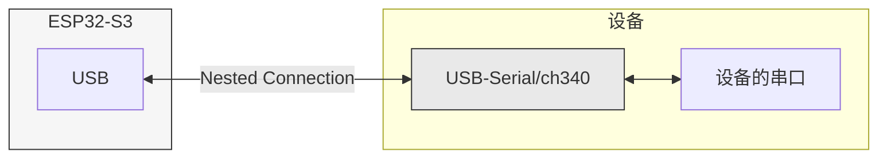

# CDC ACM VCP
USB驱动串口转USB芯片。场景如下:



esp32s3测试通过，esp32s2也支持usb-otg能力，本例程未测试。

### 移植自idf例程

移植源于 [esp-idf/examples/peripherals/usb/host/cdc/cdc_acm_vcp at v4.4.7 · espressif/esp-idf (github.com)](https://github.com/espressif/esp-idf/tree/v4.4.7/examples/peripherals/usb/host/cdc/cdc_acm_vcp)。

虽然是idf4.4.7分支的例程，但本人并未使用idf4.4.7编译通过，使用idf5.2可以编译通过，为了编译通过本人对驱动做了一点修改，兼容idf4.4.x，也就是当前使用的arduino-esp32 2.x版本。

同时加了获取设备信息的内容，所以会与idf组件库的组件有所区别。

### 配置

在main.cpp中默认配置未修改。

```cpp
#define EXAMPLE_BAUDRATE     (115200)
#define EXAMPLE_STOP_BITS    (0)      // 0: 1 stopbit, 1: 1.5 stopbits, 2: 2 stopbits
#define EXAMPLE_PARITY       (0)      // 0: None, 1: Odd, 2: Even, 3: Mark, 4: Space
#define EXAMPLE_DATA_BITS    (8)
```


### 烧录

使用platformio烧录，使用platformio的lib目录添加idf组件的离线包，无需其他配置。
