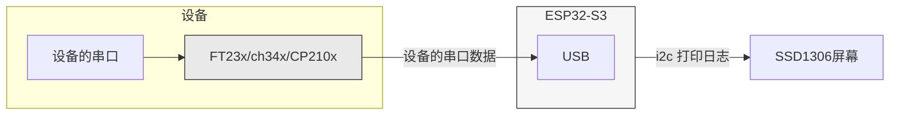

# usb串口查看器
类似于PC查看串口，直插usb查看串口。




依赖OTG功能，s2也支持OTG。 这里使用s3,打印到屏幕的任务放在1核，由于s2为单核，如果需要移植到s2需要修改`cdc_acm_vcp.cpp`中`CdcAcmVcp::start`函数里的 `cdc_acm_host_install` 参数将`xCoreID`指向0。


该例程 使用esp32 s3 dev kit c 和一个 SSD1306 驱动的128X64分辨率的i2c屏幕。

### 配置

见platformio.ini

```ini
    ## U8G2配置
    # 使用arduino variant中的常量 SDA SCL 对于esp32 s3默认是8 9
    -D U8G2_SDA=SDA
    -D U8G2_SCL=SCL
    -D U8LOG_WIDTH=20
    -D U8LOG_HEIGHT=6
    ## VCP配置
    #-D VCP_BAUDRATE=115200
    # 0: 1 stopbit, 1: 1.5 stopbits, 2: 2 stopbits
    #-D VCP_STOP_BITS=0
    #  0: None, 1: Odd, 2: Even, 3: Mark, 4: Space
    #-D VCP_PARITY=0
    #-D VCP_DATA_BITS=8
```

| 配置项        | 说明                                              | 默认值                                         |
| ------------- | ------------------------------------------------- | ---------------------------------------------- |
| U8G2_SDA      | 与屏幕通讯的i2c SDA引脚                           | SDA(选了正确板子，一般arduino variant含此常量) |
| U8G2_SCL      | 与屏幕通讯的i2c SCL引脚                           | SCL(选了正确板子，一般arduino variant含此常量) |
| U8LOG_WIDTH   | 日志屏幕宽度                                      | 20 (主要受字体大小和屏幕分辨率影响)            |
| U8LOG_HEIGHT  | 日志屏幕高度                                      | 6 (主要受字体大小和屏幕分辨率影响)             |
| VCP_BAUDRATE  | 与下位机设备通讯的串口波特率                      | 115200                                         |
| VCP_STOP_BITS | 与下位机设备通讯的串口停止位                      | 0                                              |
| VCP_PARITY    | 校验: 0: None, 1: Odd, 2: Even, 3: Mark, 4: Space | 0                                              |
| VCP_DATA_BITS | 数据位 : 5, 6, 7, 8 or 16                         | 8                                              |

### 烧录

这里移植了idf的库，放入lib文件夹 ，使用platformio烧录，无需额外配置。