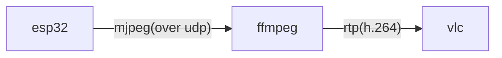
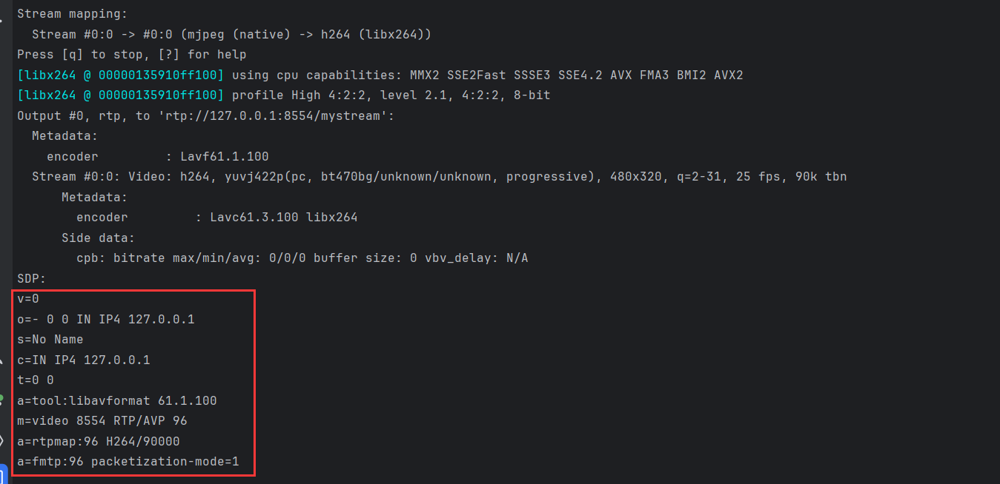

# udp-> ffmpeg


目前的esp32无视频编码能力，可以将jpeg发给ffmpeg以h.264通过rtp推送，可以一定程度减少带宽占用。

这里使用vlc播放ffmpeg推送的rtp视频流。

### 编译说明

* 修改platformio里 common下的wifi的ssid和密码
* 修改main.cpp中 服务端的地址，也就是运行ffmpeg的pc的局域网ip。

#### 支持的开发板

添加了四个烧录配置，可以在platformio切换具体环境烧录。

- esp32cam

  烧录时选择环境 `esp32cam`

- 合宙esp32s3

  烧录时选择环境 `air_mem_s3`

- esp32-wrover-cam

  [freenove-esp32-wrover-cam](https://gitee.com/link?target=https%3A%2F%2Frandomnerdtutorials.com%2Fgetting-started-freenove-esp32-wrover-cam%2F)

  烧录时选择环境 `esp32-wrover-cam`

- Freenove ESP32-S3-WROOM Board 某宝叫做 ESP32-S3 WROOM N16R8 CAM

  [Freenove/Freenove_ESP32_S3_WROOM_Board: Apply to FNK0085 (github.com)](https://gitee.com/link?target=https%3A%2F%2Fgithub.com%2FFreenove%2FFreenove_ESP32_S3_WROOM_Board)

  烧录时选择环境 `s3_wroom_cam`

#### 烧录

#####  使用vscode烧录


##### 使用clion 烧录

clion的platformio plus插件可以不用切换环境，可以勾选进行烧录。


##### 使用命令行烧录：

例如需要为esp32cam编译并上传，在项目文件夹命令运行`pio run -t upload -e esp32cam`

-e表示 指定environment 。platformio.ini 配置为[env:xxx]的选项中xxx 为这里`-e`后 的参数。

### 安装ffmpeg

在widows下可以从该地址下载安装[Builds - CODEX FFMPEG @ gyan.dev](https://www.gyan.dev/ffmpeg/builds/)

这里我下载的是最新的release版本。

linux下可以使用对应具体系统的包管理安装如apt yum。

### 烧录程序后检测esp32到ffmpeg链路

在目标PC上安装ffmpeg后执行

```shell
ffmpeg -i udp://0.0.0.0:8004 -vframes 1 test.jpg
```
可以保存一帧图片，用于检测链路是否正常

### 使用ffmpeg 进行rtp推流

以下将mjpeg转h.264使用rtp推流

```shell
ffmpeg -re -f mjpeg -i udp://0.0.0.0:8004 -c:v libx264 -preset veryfast -tune zerolatency -f rtp rtp://127.0.0.1:8554/mystream
```

### 使用vlc播放

widows下可以从这里下载vlc[Download official VLC media player for Windows - VideoLAN](https://www.videolan.org/vlc/download-windows.html)

如果是64位可以下拉选择64位的vlc。


上一步在127.0.0.1的8554端口监听,将以下内容复杂新建一个后缀为sdp的文件如`play.sdp`。

```ini
m=video 8554 RTP/AVP 96
a=rtpmap:96 H264
a=framerate:25
c=IN IP4 127.0.0.1
```

然后使用vlc打开该sdp文件，即可播放。

当然sdp文件的内容，也可以直接使用ffmpeg在收到esp32推流之后打印在控制台的内容中`SDP:`的后续几行。



以这些内容新建一个sdp文件。


如果需要走局域网，则需要改rtp的ip为局域网ip，同理sdp里面的ip也一并变化。
