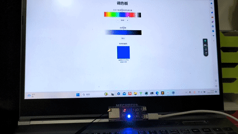

# ESP32-S3-DevKitC-1 板载RGB灯示例

### arduino环境下使用函数即可

```c
neopixelWrite(uint8_t pin, uint8_t red_val, uint8_t green_val, uint8_t blue_val);
```

参数说明: `pin` RGB引脚，在arduino下选对开发板时宏`RGB_BUILTIN` 来代替。后续三个参数 就是rgb值。

### 本例程是使用web调色板控制rgb灯的颜色



基于platformio

日志示例如下:

```tex
ESP-ROM:esp32s3-20210327
Build:Mar 27 2021
rst:0x1 (POWERON),boot:0x8 (SPI_FAST_FLASH_BOOT)
SPIWP:0xee
mode:DIO, clock div:1
load:0x3fce3808,len:0x44c
load:0x403c9700,len:0xbe4
load:0x403cc700,len:0x2a68
entry 0x403c98d4

..
Connected to test0
MDNS responder started
[  1244][I][main.cpp:62] setup(): MDNS responder started
HTTP server started
http://192.168.137.159
http://esp32S3
[  1256][I][main.cpp:76] setup(): http://esp32S3
[  1256][I][main.cpp:78] setup(): http://192.168.137.159
```

其中esp32S3是mdns的域名，而如果使用手机则默认不打开mdns是无法通过域名访问，可以使用http://ip地址访问。

本例程无需构建web，index.html已经被压缩为gzip后直接写到数组中了。

根据需要修改代码里面的rgb引脚已经wifi名密码。

