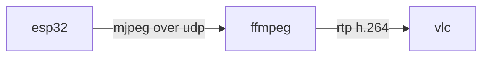

# 驱动usb摄像头推流

esp32 s3 usb摄像头推流



将jpeg发给ffmpeg以h.264通过rtp推送，可以一定程度减少带宽占用。

这里使用vlc播放ffmpeg推送的rtp视频流。


移植于一个IDF项目[esp-iot-solution/examples/usb/host/usb_camera_mic_spk at master · espressif/esp-iot-solution · GitHub](https://github.com/espressif/esp-iot-solution/tree/master/examples/usb/host/usb_camera_mic_spk)

官方文档 [USB Stream 组件说明 - - — ESP-IoT-Solution latest 文档 (espressif.com)](https://docs.espressif.com/projects/esp-iot-solution/zh_CN/latest/usb/usb_host/usb_stream.html)


当前基于arduino 2.0.1x的platformio,因为移植过程中发现了usb的`private_include` 未被编译打包到arduino中，于是拷贝一份idf4.4.7的 usb组件到platformio `lib`目录，如果基于arduino 3.0.x则对应 idf5.1.x，建议重新拷贝一份。


### 硬件

#### 摄像头

这里使用乐鑫官方店的usb摄像头，其他厂商的不一定支持，本人购买过其他摄像头，虽然也支持
目标分辨率和编码格式，但驱动并未适配好，无法使用本例程。

#### 开发板

esp32s3 n16 r8. 这里用到psram缓存帧，否则udp发送会报 12内存不够。代码已经固定为使用psram申请帧，请使用带psram的s3。


### 编译说明

修改platformio.ini的connection选项，指定wifi ssid和密码 以及服务端ip,这里是运行ffmpeg的主机的ip.

```ini
[connection]
wifi_ssid = \"test0\"
wifi_password = \"12345687\"
host = \"192.168.0.121\"
```

### 安装ffmpeg

在widows下可以从该地址下载安装[Builds - CODEX FFMPEG @ gyan.dev](https://www.gyan.dev/ffmpeg/builds/)

这里我下载的是最新的release版本。

linux下可以使用对应具体系统的包管理安装如apt yum。

### 烧录程序后检测esp32到ffmpeg链路

在目标PC上安装ffmpeg后执行

```shell
ffmpeg -i udp://0.0.0.0:8004 -vframes 1 test.jpg
```

可以保存一帧图片，用于检测链路是否正常

### 使用ffmpeg 进行rtp推流

以下将mjpeg转h.264使用rtp推流

```shell
ffmpeg -re -f mjpeg -i udp://0.0.0.0:8004 -c:v libx264 -preset veryfast -tune zerolatency -f rtp rtp://127.0.0.1:8554/mystream
```

### 使用vlc播放

widows下可以从这里下载vlc[Download official VLC media player for Windows - VideoLAN](https://www.videolan.org/vlc/download-windows.html)

如果是64位可以下拉选择64位的vlc。


上一步在127.0.0.1的8554端口监听,将以下内容复制新建一个后缀为sdp的文件如`play.sdp`。

```ini
m=video 8554 RTP/AVP 96
a=rtpmap:96 H264
a=framerate:25
c=IN IP4 127.0.0.1
```

然后使用vlc打开该sdp文件，即可播放。

当然sdp文件的内容，也可以直接使用ffmpeg在收到esp32推流之后打印在控制台的内容中`SDP:`的后续几行。

以这些内容新建一个sdp文件。

如果需要走局域网，则需要改rtp的ip为局域网ip，同理sdp里面的ip也一并变化。


## 其他附加

### ffmpeg录制esp32视频

```bash
ffmpeg -re -f mjpeg -i udp://0.0.0.0:8004 -c:v libx264 -preset medium -crf 23 output.mp4
```

`-crf 23`是一个常见的恒定速率因子值，用于平衡文件大小和质量。较低的CRF值意味着更高的质量和更大的文件大小。